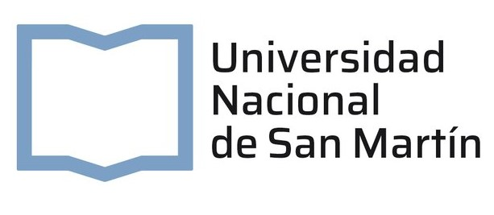
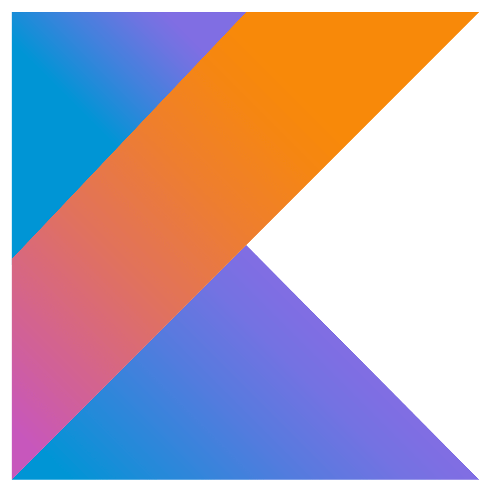

<h1 align=center>Hola, soy Francisco Coronel 👋</h1>
<table align=center>
<tr>
  <td>Tengo 23 años y estudio la Tecnicatura en Programación Informática de la UNSAM.</td>
  <td></td>
</tr>
</table>
Soy un desarrollador full-stack con experiencia creando web apps en ReactJS y Angular 18, y conectándolas con un backend hecho con Kotlin + Spring Boot.
<h2>Mis proyectos</h2>
<ul>
  <li><strong>React</strong> - Proyecto grupal de front-end maquetado usando la biblioteca Chakra UI que se conecta al backend desarrollado en Kotlin.
  <li><strong>Angular</strong> - Proyecto grupal de front-end maquetado "a mano" con HTML y CSS que también se conecta al backend desarrollado en Kotlin.
  <li><strong>Kotlin</strong> - Proyecto grupal de <a href="https://github.com/franncoronel/readApp_proyectoKotlin/tree/main"> back-end</a> usando patrones de diseño y Spring Boot.</li>
  <li><strong>C</strong> - Trabajo final individual de <a href="https://github.com/franncoronel/TP-Laboratorio-De-Computacion-2">archivos</a>.</li>
  <li><strong>Python</strong> - Proyectos grupales de <a href="https://github.com/franncoronel/TP-PandaS-Matematica-3">análisis de datos</a> y <a href="https://github.com/franncoronel/TP-NN-Matematica-3">machine learning</a>.</li>
  <li><strong>Wollok</strong> - Desarrollo grupal de un videojuego usando software educativo de OOP.</li>
  <!-- AGREGAR CUANDO ESTÉ TERMINADO <li>Desarrollo web - Portfolio</li> -->
</ul>
<h2>Lenguajes y herramientas de programación<h2>

          

<h1 align=center>Contactame!</h1>
<ul>
  <li>Mail - <a href="mailto:www.ffranncoronel@gmail.com">ffranncoronel@gmail.com</a></li>
  <li>Perfil de <a href="https://www.linkedin.com/in/coronelfrancisco/">LinkedIn</a></li>
</ul>
